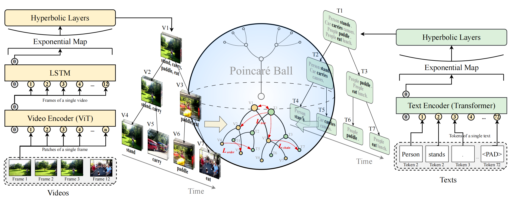

# HOVER: Hyperbolic Video-text Retrieval



## 🗄 Data Preparation

You can follow the steps in [Clip4CLIP](https://github.com/ArrowLuo/CLIP4Clip#data-preparing).

The data directory looks like [this](./data/README.md).

## 🚴 Training and Evaluation

You can use our bash files:

```bash
bash atrain.sh		# train on ActivityNet
bash atest.sh		# evaluate on ActivityNet
bash ctrain.sh		# train on Charades
bash ctest.sh		# evaluate on Charades
bash mtest.sh		# evaluate on MSR-VTT
```

Or directly use commands:

```bash
DATA_PATH=./data/anet
python -m torch.distributed.launch --nproc_per_node=2 --master_port='29158' \  # # of GPUs, independent port
main_task_retrieval.py --do_train --num_thread_reader=0 \
--epochs=15 --batch_size=64 --n_display=50 \
--train_csv train_tree_deep \
--val_csv test_tree_deep \
--data_path ${DATA_PATH} \
--features_path ${DATA_PATH}/videos_compressed \
--output_dir ckpts/<name> \  # ckpt dir
--lr 1e-4 --max_words 72 --max_frames 12 --batch_size_val 48 \
--datatype anet \
--feature_framerate 1 --coef_lr 1e-3 \
--freeze_layer_num 0  --slice_framepos 2 \
--loose_type --linear_patch 2d --sim_header seqLSTM \
--pretrained_clip_name ViT-B/32 \
--init_model /ckpts/<name>/pytorch_model.bin.0 \  # load model
--resume_model /ckpts/<name>/pytorch_opt.bin.0    # load optimizer
```

## 🙏 Acknowledgements

Our code is based on CLIP4Clip: [https://github.com/ArrowLuo/CLIP4Clip](https://github.com/ArrowLuo/CLIP4Clip).

For the hyperbolic networks, we adopted the implementation in: [https://github.com/leymir/hyperbolic-image-embeddings](https://github.com/leymir/hyperbolic-image-embeddings).
